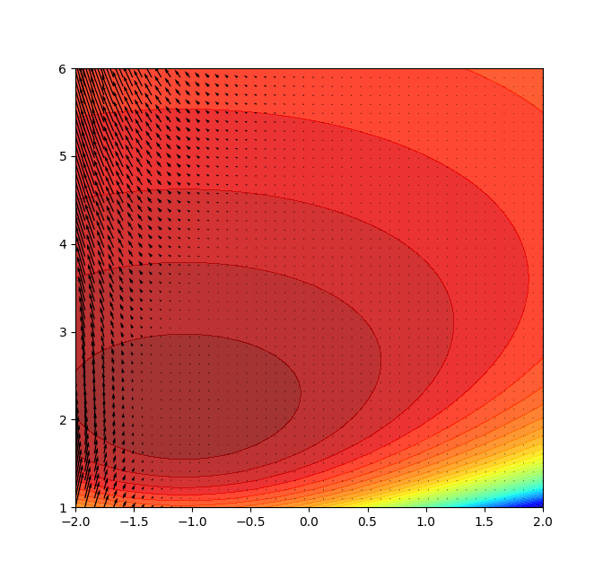

# Autolik

Autolik aims at providing interface of automatic differentiation for likelihood maximization routine. It not only supports various distributions probability density function and their log-likelihood functions, but also the gradient of log-likelihood functions. For example, Normal, Gamma, Laplace, Pareto, T, Generalized Gamma, Generalized Pareto, ,Inverse Gaussian, Inverted Gamma, Lomax, Minimax, Rayleigh, Weibull and so on. It also supports self-defined python functions and provides fast automatic differentiation api on it.

**_Example use:_**

```python
>>> from autolik import Dual # for self-defined functions use
>>> import autolik
>>> import matplotlib.pyplot as plt
>>> from matplotlib.pyplot import cm
>>> import numpy as np
>>> def z(x,y): # self-defined function
...     if isinstance(x,Dual) or isinstance(y,Dual): # autolik.Dual computation
...         return x * (-x**2 - y**2).exp()
...     else:
...         return x * np.exp(-x**2 - y**2)
>>> z_grad = autolik.grad(z) # gradient function
>>> x = np.linspace(-2,2,100)
>>> y = np.linspace(-2,2,100)
>>> X,Y = np.meshgrid(x,y)
>>> Z = np.array([[z(i,j) for i in x] for j in y])
>>> vx = np.linspace(-2,2,50)
>>> vy = np.linspace(-2,2,50)
>>> vX,vY = np.meshgrid(vx,vy)
>>> Z_grad = np.array([z_grad([i,j]) for i in vx for j in vy]) # gradient vectors
>>> ax = plt.axes()
>>> ax.contourf(X,Y,Z,levels=50, cmap=cm.jet, alpha = 0.7)
>>> ax.quiver(vX,vY,Z_grad[:,0],Z_grad[:,1])
>>> plt.show()
```


## Use the built in log-likelihood functions to compute the gradients

[List of supported build-in log-likelihhood api](docs/api_list.md) for gradient computation

**_Example:_**

```python
>>> import autolik
>>> import numpy as np
>>> y = np.random.normal(-1,2,100)
>>> def loglik_normal(mu,sigma): # prepare the logliklihood function
...    return autolik.ll.normal(y, mu, sigma)
>>> g = autolik.grad(loglik_normal) # generate the gradient for the logliklihood function
>>> import matplotlib.pyplot as plt
>>> from matplotlib.pyplot import cm
>>> mu = np.linspace(-2,2,50)
>>> sig = np.linspace(1,6,50)
>>> Mu,Sigma = np.meshgrid(mu,sig)
>>> loglik = np.array([[loglik_normal(i,j) for i in mu] for j in sig])
>>> loglik_grad = np.array([g([i,j]) for i in mu for j in sig])
>>> ax = plt.axes()
>>> ax.contourf(Mu,Sigma,loglik, levels=50, cmap=cm.jet, alpha = 0.8) # plot the contour of log-likelihood function
>>> ax.quiver(Mu,Sigma,loglik_grad[:,0],loglik_grad[:,1]) # plot the gradient vectors of log-likelihood function
>>> plt.show()
```



## Supported operators and functions

[List of supported operators and functions](docs/operator_list.md) for gradient computation

Autolik supports the basic operators (e.g. `+`, `-`, `*`, `**`, `/` ...) and special functions (e.g. `sin`, `cos`, `exp`, `log`, `gamma`, `beta` ...)

## Author

Autolik is written by Langyan Zang. The package is currently in the very beginning stage, any kind of contribution is welcome. Autolik is currently developed by Lanyan solely, the understanding of the slow development would be appreciated. For advices, please do not hesitate to write an email [<langyan.zang@uzh.ch>](langyan.zang@uzh.ch) and instruct me ^.^.